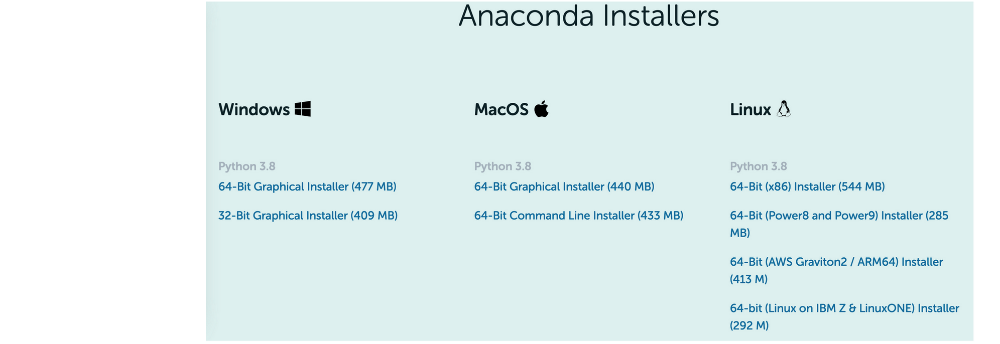
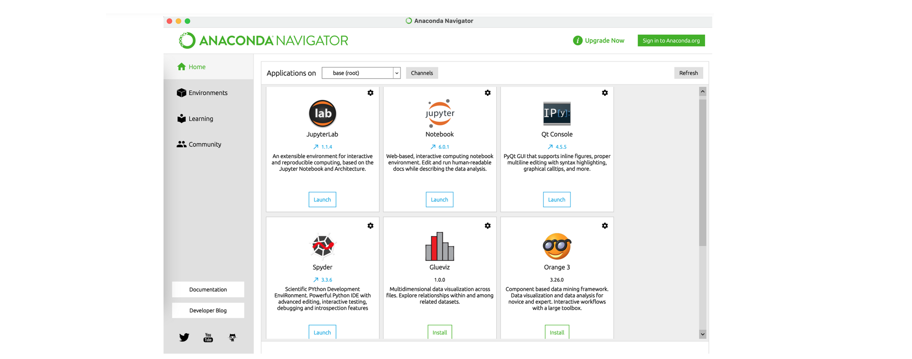

# Installing Python 

The easiest way to install python (and some related data science toolkits) is to install [Anaconda](https://www.anaconda.com/products/individual-d).

## 1. Anaconda 

Anaconda is created by Continuum Analytics, and it is a Python distribution that comes preinstalled with lots of useful python libraries for data science. Installing ananconda enables you to have a functional python environment alongside with many tools for coding *data science / machine learning* projects.

## 2. Step by step installation 

Let us install Anaconda, python and Jupyter Notebook

#### STEP 1 : Download & Install Anaconda

- Go to https://www.anaconda.com/products/individual
- Scroll down and choose the **adequate operating system**

- Be careful, Ananconda might ask you which python's version to choose. *You have to choose Python 3.X*: do not choose Python 2.X displayed bellow since it will not be updated or improved anymore.

- After opening the downloaded executable file it is quite straightforward: **press *Next*** until the whole Anaconda ecosystem is installed on your computer. **This process might take a while (30 minutes for me)**.

- Once the Anaconda ecosystem installed, you will have the following home screen of the Anaconda Navigator app

- Great, now you have the environment python (and as a bonus the language R) installed on your computer!

#### STEP 2 : Install Jupyter Notebook (and eventually Spyder)

- Install Jupyter Notebook. 

Jupyter notebook is a novel IDE to produce easy-to-read reports with text, equations, code and results (called a notebook). **This is what is used here!**. In a nutshell, a notebook is sequence of cells that contain Python commands with comments. For some useful shortcuts, see *Help > Keyboard Shortcuts*. As usual Let us now print *Hello world!* as an initiation ritual (just be sure to have a functional python environment!).

- Let us launch it:

**Remark:** since Python is a scripting language, there are several ways to use this language. The main ones are detailed below.

#### STEP 3 : print hello world! with Jupyter Notebook

- After launching Jupyter Notebook you'll have the following window on your default browser (at least something roughly similar):

- Click **New** and then select **Python 3**. A new window will be created: it's your Jupyter Notebook!

- Congratulations you can now write your first python program:

#### STEP 3b (OPTIONAL) : print hello world! with command line or Spyder

**Command line**

In a shell, execute:

    $ python

Then, start using it:

    >>> print("hello world!")

Press CTRL+D or type:

    >>> quit()

to exit.

If your code is written in a file *script.py*, you can run it from a shell with:

    $ python script.py

or in Python with:

    >>> execfile('script.py')
    
**Spyder**

[Spyder](http://pythonhosted.org/spyder/) is an IDE that shows both an editor and a Python shell.
It is an efficient tool for developping and testing codes.

In particular feature, it enables to run only part of the script while keeping the previous results (variable states) in memory.

To run a script, you can edit it and press F5.
If you want to execute only a selection of it, select the part of interest and press F9.
