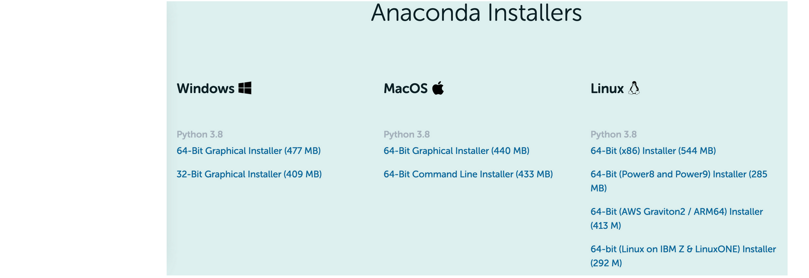
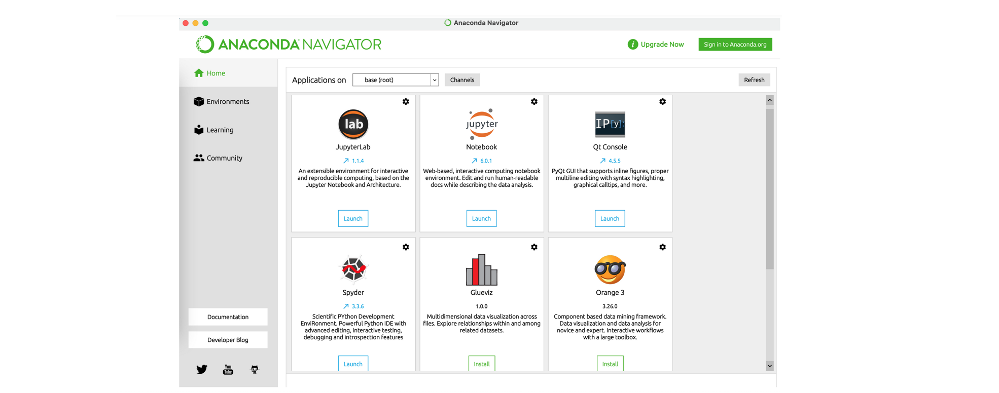
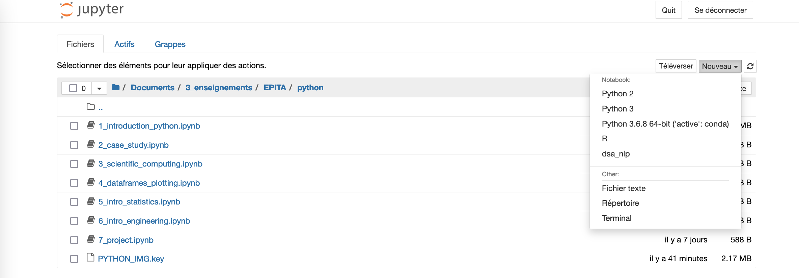
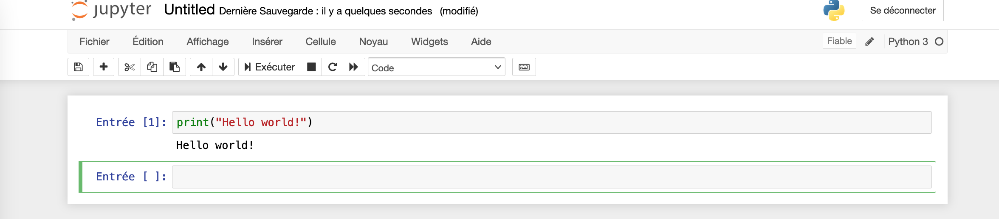

There is no single official way to install Python, which is the honest reason
this page exists. Below are the two routes that work, when to pick each, and the
handful of conventions that separate an installation that lasts a semester from
one that breaks in week three.

**If you want the short answer:** install
[Miniforge](https://conda-forge.org/download/), create one environment per
project, and never install anything into `base`.

## 1. Two routes

| | **conda** (Miniforge / Anaconda) | **pip + venv** (or [uv](https://docs.astral.sh/uv/)) |
| --- | --- | --- |
| Installs | Python *and* non-Python dependencies (BLAS, compilers, R, CUDA) | Python packages only |
| Best for | Data science, teaching machines, anything with heavy numerics | Web, tooling, deployment, lean projects |
| Download | ~100 MB (Miniforge), ~1 GB (Anaconda) | ~30 MB |

For this course either works, and **conda is the safer default** because it
handles the compiled libraries underneath NumPy and SciPy for you, on Windows
in particular.

A word on distributions, since the names are confusing:

- **Anaconda** is the batteries-included distribution: Python plus several
  hundred preinstalled packages and a graphical Navigator. Convenient, large,
  and — since the 2024 change to its terms — **subject to a paid licence for
  larger organisations**. Check with your employer before putting it on a work
  laptop.
- **Miniforge** is the minimal installer that ships `conda` configured to use
  the community-run **conda-forge** channel. Same tool, no licensing question,
  and you install only what you need. This is what I use.
- **Miniconda** is Anaconda's own minimal installer, and carries the same terms
  as Anaconda.

## 2. Route A — conda, step by step

### Step 1: download and install

- Go to [conda-forge.org/download](https://conda-forge.org/download/) for
  Miniforge, or [anaconda.com/download](https://www.anaconda.com/download) if
  your institution provides Anaconda.
- Pick the installer matching your **operating system and CPU architecture**
  (Apple Silicon and Intel Macs are different downloads; on Windows, take the
  64-bit one).


*Installers are per-OS and per-architecture. Take Python 3.x — Python 2 reached
end of life in January 2020 and is gone.*

- Run the installer and accept the defaults. On Windows, do **not** tick "add to
  PATH"; use the *Miniforge Prompt* / *Anaconda Prompt* shortcut instead, which
  is what the installer is telling you when it warns you off. Installation takes
  a few minutes, or up to half an hour for full Anaconda.

If you installed Anaconda, you now also have the Navigator, a graphical front
end to environments and applications:


*The Navigator, if you installed Anaconda. Everything it does is also one
command away, and the command line is the version that fits in a README.*

### Step 2: create an environment

This is the step people skip and later regret. An **environment** is an isolated
set of packages with its own Python. One per project means a broken dependency
in one place cannot break anything else, and the environment is throwaway —
which is what makes it safe to experiment.

```bash
conda create -n course python=3.12 numpy pandas matplotlib scikit-learn jupyterlab
conda activate course
```

Your prompt should now be prefixed with `(course)`. Rules of thumb:

- **Never install into `base`.** Keep it for `conda` itself.
- **Prefer `conda install` over `pip install` inside a conda environment**, and
  when you must mix, install everything you can with conda *first*, then pip.
  Mixing in the other order is the most common way to corrupt an environment.
- Record what you use: `conda env export --from-history > environment.yml`.
  That file, committed next to your code, is what makes the work reproducible.

To start again from scratch, which is always allowed:

```bash
conda deactivate
conda env remove -n course
```

## 3. Route B — plain Python, venv and pip

If you would rather not have conda, install Python from
[python.org](https://www.python.org/downloads/) (on Windows, tick
*Add python.exe to PATH*), then:

```bash
python -m venv .venv
source .venv/bin/activate        # Windows: .venv\Scripts\activate
pip install numpy pandas matplotlib scikit-learn jupyterlab
pip freeze > requirements.txt
```

Faster modern alternative, if you like your tools sharp: `uv` replaces
`venv`, `pip` and `pip-tools` in one binary and resolves environments in
seconds.

```bash
uv venv && uv pip install numpy pandas matplotlib scikit-learn jupyterlab
```

## 4. Check that it works

```bash
python -c "import sys, numpy; print(sys.version); print(numpy.__version__)"
```

If that prints a 3.x version and a NumPy version, you are done. If the shell
answers *command not found* or *'python' is not recognised*, your environment is
not activated — go back and run `conda activate course` (or `source
.venv/bin/activate`) in the terminal you are actually using.

## 5. Where you will write code

### Jupyter — for exploration and reports

A notebook is a sequence of cells mixing text, equations, code and results.
**This is the format used throughout the course**, because it keeps the
reasoning and the output in the same document.

```bash
jupyter lab        # or: jupyter notebook
```

It opens in your browser. Use *Help > Keyboard Shortcuts* early; `Shift+Enter`
to run a cell and `Esc` then `A`/`B` to insert one above/below will cover most
of your day.


*The file browser. New notebook: click **New** (or the Launcher) and pick your
Python 3 kernel.*


*The initiation ritual. `print("hello world!")`, `Shift+Enter`.*

One catch worth knowing before it bites you: the notebook's **kernel** is a
specific Python, and it is not always the environment you think. Check with
`import sys; print(sys.executable)` in a cell. If your environment is missing
from the kernel list, register it:

```bash
conda activate course
python -m ipykernel install --user --name course --display-name "Python (course)"
```

### An editor — for code you keep

Notebooks are excellent for exploring and poor for anything reused: cells run
out of order, and the hidden state is invisible. Once code stabilises, move it
into `.py` files and import it.

- **[VS Code](https://code.visualstudio.com/)** with the Python and Jupyter
  extensions is the common default, and runs notebooks natively.
- **[Spyder](https://www.spyder-ide.org/)** is closer to Matlab or RStudio: an
  editor, a console and a variable explorer side by side. `F5` runs the file,
  `F9` runs the selection while keeping previous variables in memory.
- **[PyCharm](https://www.jetbrains.com/pycharm/)** if you want a full IDE,
  free for students.

### The command line — for everything else

Start an interactive session:

```bash
python              # or: ipython, which is the same thing but pleasant
```

```python
>>> print("hello world!")
hello world!
>>> quit()          # or Ctrl-D
```

Run a script:

```bash
python script.py
```

And from inside IPython or a notebook, when you want a script's variables left
in your session afterwards:

```python
%run script.py
```

## 6. When something goes wrong

| Symptom | Usual cause |
| --- | --- |
| `command not found: python` | Environment not activated, or wrong terminal |
| `ModuleNotFoundError` for a package you just installed | Installed into a different environment from the one running |
| Notebook cannot see your packages | Kernel points elsewhere — check `sys.executable`, register the kernel |
| `conda` hangs while solving | Use Miniforge/conda-forge, or `conda install -c conda-forge`; `mamba` solves the same environments far faster |
| Everything is broken | Delete the environment and recreate it from your `environment.yml`. This is why the file exists. |

---

Next: [why Python in the first place]({{ '/blog/why-python/' | relative_url }}),
or go straight to the
[course notebooks]({{ '/teaching/' | relative_url }}).
