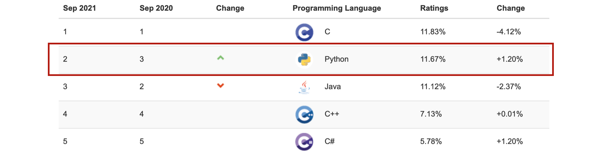
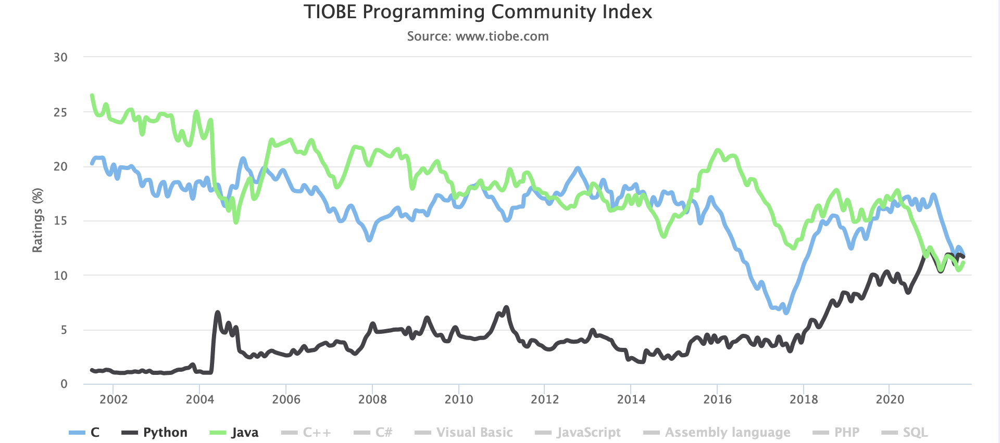

Every course that starts with a language owes you a justification for the
choice. This is mine. It is not "Python is the best language" — no language is
— but Python is, today, the shortest path between a statistical idea and a
result somebody else can reproduce.

## 1. What Python is

[Python](https://www.python.org/about/) is a **high-level, interpreted,
dynamically typed** language created by Guido van Rossum and first released in
1991. High-level means the language hides the machine from you: no memory
allocation, no pointers, no compilation step to think about. That is the whole
trade, and everything below follows from it.

Two words worth pinning down now, because the rest of this page leans on them:

- **Interpreted** — your code is executed statement by statement by another
  program (the interpreter), rather than translated ahead of time into machine
  code. You get instant feedback and one error at a time; you pay in speed.
- **Dynamically typed** — a variable has no declared type. `x = 3` then
  `x = "three"` is legal, and the type is only known while the code runs. You
  write less; the compiler catches less.

## 2. Where it stands today

Python has been number one in the [TIOBE index](https://www.tiobe.com/tiobe-index/)
since October 2021, and its lead has since become embarrassing: **18.5% in
August 2026**, against roughly 11% for C and 8% for C++. Historically only C and
Java had ever led that index.

*TIOBE top languages. The index is built from search-engine volume, so read it
as attention, not as lines of code in production.*

[PYPL](https://pypl.github.io/PYPL.html), which counts how often language
tutorials are searched on Google, puts Python first by a wider margin still —
unsurprising for a language that absorbs a constant stream of newcomers.

*PYPL: tutorial searches on Google.*

## 3. Twenty years of drift

The interesting part of that curve is not that Python rose. It is *what it rose
against*: Java and C++ in general programming, and Matlab, R and SAS in
scientific computing. Python did not win a language argument. It won because
NumPy, then scikit-learn, then PyTorch and TensorFlow all chose it as their
front end, and the data eventually followed the tools.

## 4. Some pros

Non-exhaustive reasons for its popularity:

1. **The syntax.** Simple, close to pseudo-code, mostly English words.
   Indentation is the block structure, so badly formatted Python does not
   compile — which turns out to be a feature when you read other people's code.

2. **Free and open-source**, under a permissive licence, on every platform.

3. **Extensive libraries.** The standard library plus the *Python Package Index*
   (PyPI, well over 600 000 packages) means most of what you need already
   exists: NumPy and SciPy for numerics, pandas and Polars for tables,
   scikit-learn for machine learning, PyTorch for deep learning, matplotlib and
   Plotly for graphics, statsmodels and lifelines for the statistics an actuary
   actually wants.

4. **Multi-purpose.** Scientific computing, web back ends, automation, software
   engineering, all in one language. This matters more than it sounds: a model
   that stays in a notebook is not a model anybody uses, and Python takes you
   from the notebook to the API without switching languages.

5. **Object-oriented** (and quite happily functional too), so projects can be
   structured and maintained rather than accumulated.

6. **Interpreted**, which means an interactive prompt, immediate feedback, and
   the ability to poke at a live object to find out what it does. This is the
   single biggest reason exploratory data analysis feels good in Python.

7. **Dynamically typed**, so prototypes come together fast. Type *hints* were
   added later for the code you keep, and tools like `mypy` check them without
   ever slowing the interpreter down.

8. **Companies use it.** Python glues well to the rest of a production stack —
   databases, message queues, CI, cloud SDKs — so the same language survives the
   trip from research to an end-to-end pipeline. Google, Netflix, Meta and most
   insurers' data teams all run on it.

9. <b>Last but not least:</b> the community. Your
   question has almost certainly been asked already, and answered. Documentation,
   forums, tutorials and a steady stream of contributors are a genuine technical
   asset, not a soft one.

## 5. Some cons

An honest list, because you will meet all of these:

1. **It is slow.** Interpreted and dynamically typed means pure-Python loops run
   one to two orders of magnitude slower than C. The standard answer is to not
   write those loops: push the work into NumPy, pandas or a compiled library,
   where the inner loop is already C or Fortran. When that is not enough, Numba,
   Cython, JAX or a Rust extension will get you the rest of the way.

2. **It is not memory efficient.** Every value is an object with a header, so a
   Python list of a million integers costs far more than a million machine
   integers. Again, NumPy arrays and pandas or Polars dataframes exist precisely
   to store data densely.

3. **Concurrency is awkward.** The Global Interpreter Lock has long prevented
   several threads from executing Python bytecode at once, pushing everyone
   towards multiprocessing. This is finally changing — CPython 3.13 shipped an
   experimental free-threaded build and 3.14 made it officially supported — but
   the ecosystem will take a few more years to catch up.

4. **Packaging and environments are a mess.** pip, conda, Poetry, uv, virtualenv,
   wheels, lockfiles: the tooling is powerful and badly signposted, and "it works
   on my machine" is a Python speciality. This is why
   [installing Python properly]({{ '/pages/install_python.html' | relative_url }})
   gets its own page, and why every serious project pins its dependencies.

5. **Some domains are still better served elsewhere.** R remains ahead for parts
   of classical and actuarial statistics, and Matlab for some engineering
   toolboxes. In practice you use both and connect them; `reticulate` and
   `rpy2` exist for exactly that.

**Most of these drawbacks are addressable** — by a library, a compiler, or a
convention — which is precisely why the language keeps winning despite them.

## 6. What this means for the rest of the course

You are going to spend most of your time in a small subset of the language,
calling libraries that are not written in Python at all. That is normal, and it
is the intended way to use it: Python is the language in which you *describe*
the computation, not usually the one in which the computation runs.

Next step: [install a working environment]({{ '/pages/install_python.html' | relative_url }}).
